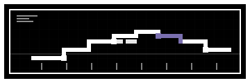

<p align="center">
  
</p>

# LINwalker

**LINwalker** is a lightweight Python toolkit for exploring hierarchical population structure and interspecies introgression using LIN codes (e.g., from PubMLST cgMLST schemes).

LINwalker treats LIN codes as ordered, multi-resolution descriptors rather than flat identifiers, enabling scale-aware analysis of:
- lineage diversification
- reservoir structure
- species boundary erosion (introgression)
- concordance with MLST ST and clonal complex

The package was developed and tested using Campylobacter jejuni / coli cgMLST data, but is applicable to any organism with LIN annotations.

## What it does

LINwalker provides five core analyses:

1. **Diversification by scale**
How the number of unique LIN clusters grows as LIN resolution increases (thresholds 1–17), stratified by source.

2. **Mixed-species LIN clusters**
Proportion of LIN clusters that contain more than one species at each LIN threshold — a scale-aware introgression signal.

3. **LSDD (LIN Species Discordance Depth)**
A per-isolate metric describing the earliest LIN level at which the isolate’s LIN cluster majority species differs from its assigned species.

4. **LIN <> MLST concordance**
Quantifies how well LIN clusters correspond to MLST sequence types (ST) and clonal complexes (CC) across LIN thresholds.

5. **Outbreak / public-health summaries**
   Descriptive outputs to support outbreak-style exploration: per-isolate LIN cluster
   size vs threshold (with optional boxplot+points), a table of the largest clusters
   at a chosen LIN threshold, and optional epi-curve by collection date.
   
## Quickstart: generic PubMLST Campylobacter walkthrough

This is an end-to-end run using a **PubMLST isolate export** (TSV/CSV) that includes a LIN code column.

### 1) Prepare derived tables

```bash
python -m linwalker prep \
  --input your_pubmlst_export.tsv \
  --outdir results/run_001/prep \
  --lin-col LINcode \
  --id-col isolate \
  --species-col Species \
  --source-col Source \
  --country-col Country \
  --date-col Collection_date
```

Outputs:
- `results/run_001/prep/derived/PATHSAFE_LINwalker_min.tsv` (analysis-ready)
- `results/run_001/prep/derived/PATHSAFE_metadata_only.tsv` (metadata-only)

### 2) Diversification curves

```bash
python -m linwalker diversify \
  --input results/run_001/prep/derived/PATHSAFE_LINwalker_min.tsv \
  --outdir results/run_001/diversification \
  --thresholds 1-17 \
  --formats png svg
```

Outputs (stable structure):
- `results/run_001/diversification/plots/`
- `results/run_001/diversification/tables/`
- `results/run_001/diversification/logs/`

Key plots:
- `diversification.svg` / `.png` (reservoir sources only)
- `diversification_all_sources.svg` / `.png` (includes human + other)

Rarefaction (sample-size normalisation):
LIN diversity curves can be strongly affected by uneven sampling (e.g. many more
human isolates than any single reservoir). By default, LINwalker also produces
rarefied curves that downsample each source to an equal n per source (n = the
minimum source size among the plotted groups), repeating subsampling many times
and plotting the mean ± SD:
- `diversification_rarefied.svg` / `.png`
- `diversification_all_sources_rarefied.svg` / `.png`

You can disable rarefaction with `--no-rarefy`.

### 3) Introgression summaries (mixed species + LSDD)

```bash
python -m linwalker introgress \
  --input results/run_001/prep/derived/PATHSAFE_LINwalker_min.tsv \
  --outdir results/run_001/introgression \
  --thresholds 1-17 \
  --formats png svg
```

### 4) Relate LIN thresholds to ST / CC

```bash
python -m linwalker stcc \
  --input results/run_001/prep/derived/PATHSAFE_metadata_only.tsv \
  --outdir results/run_001/stcc \
  --thresholds 1-17 \
  --formats png svg
```

### 5) Outbreak / public health descriptives

```bash
python -m linwalker outbreak \
  --input results/run_001/prep/derived/PATHSAFE_LINwalker_min.tsv \
  --outdir results/run_001/outbreak \
  --thresholds 1-17 \
  --top-threshold 12 \
  --top-n 25 \
  --formats png svg
```

### 6) Tree colouring metadata (Microreact/iTOL)

```bash
python -m linwalker tree \
  --input results/run_001/prep/derived/PATHSAFE_LINwalker_min.tsv \
  --outdir results/run_001/tree \
  --threshold 12
```

This writes metadata you can join to an existing tree.

## Output structure (stable)

Every module writes to:

```
<outdir>/plots/
<outdir>/tables/
<outdir>/logs/
```

## Help

```bash
python -m linwalker --help
python -m linwalker diversify --help
```

Or just run everything using: 

```bash
python -m linwalker diversify \
  --input data/derived/PATHSAFE_LINwalker_min.tsv \
  --outdir results/diversification \
  --formats png svg

python -m linwalker introgress \
  --input data/derived/PATHSAFE_LINwalker_min.tsv \
  --outdir results/introgression \
  --formats png svg

python -m linwalker stcc \
  --input data/derived/PATHSAFE_metadata_only.tsv \
  --outdir results/stcc \
  --formats png svg

python -m linwalker outbreak \
  --input data/derived/PATHSAFE_LINwalker_min.tsv \
  --outdir results/outbreak \
  --thresholds 1-17 \
  --top-threshold 12 \
  --top-n 25 \
  --formats png svg
```

## Notes on interpretation (*Campylobacter*)
- LIN thresholds are strictly 1–17
- LIN codes are treated as cumulative prefixes, not independent columns
- Human isolates often dominate diversity curves and are therefore separated by default
- LSDD provides a scale-aware measure of species boundary erosion
- ST/CC concordance identifies LIN thresholds that approximate legacy typing units

### Interpreting LIN-based introgression metrics (LSDD)

LIN codes describe genetic relatedness at multiple nested scales, from very coarse (early LIN levels) to very fine (later LIN levels). This makes them useful not just for clustering isolates, but for asking where in the genetic hierarchy different biological signals appear.

#### *What is LSDD?*

LSDD (LIN Species Discordance Depth) is a per-isolate measure of how deep into the LIN hierarchy you have to go before species labels become inconsistent.

In practice, for each isolate:
1. LINwalker considers the isolate’s LIN clusters at each threshold (LIN 1 → LIN 17).
2. At each threshold, it asks:
    - *“What is the majority species among all isolates sharing this LIN prefix?”*
3. LSDD is defined as the earliest LIN level at which the isolate’s assigned species differs from the majority species of its LIN cluster.

If no discordance is observed at any level (LIN 1–17), the isolate is assigned the maximum value.

#### *How to interpret LSDD values*

LSDD is scale-aware by construction. Its biological interpretation depends on where discordance appears.

*Low LSDD values (early LIN levels)*
- Species discordance appears at coarse genetic scales
- Indicates deep or widespread mixing between species
- Suggests erosion of species boundaries that extends across broad lineages

In Campylobacter, this may reflect:
- long-term introgression
- shared ancestral structure
- extensive recombination across species boundaries

*High LSDD values (late LIN levels)*
- Species discordance only appears at fine genetic scales
- Most of the lineage structure remains species-consistent
- Mixing is localized or recent

This pattern is consistent with:
- occasional recombination events
- rare hybrid lineages
- spillover without sustained transmission

*Maximum LSDD (no discordance)*
- Species identity is consistent across all LIN levels
- No evidence of detectable interspecies mixing within the LIN hierarchy

#### *Why LSDD is useful*

Traditional approaches often treat introgression as a binary property (mixed vs not mixed). LSDD instead asks:
    *At what evolutionary scale does species mixing become visible?*

This allows you to distinguish between:
- deep, lineage-wide species boundary erosion
- versus shallow, fine-scale recombination events

Because LSDD is calculated per isolate, it can also be:
- summarised by source or host
- compared across datasets
- linked to other metadata (e.g. ecology, geography, clinical status)

#### *Important caveats*
- LSDD does not identify specific recombination tracts or donor lineages.
- It should be interpreted as a population-structural signal, not direct mechanistic evidence.
- Values depend on the resolution and composition of the reference dataset.

LSDD is therefore best used as:
- a comparative, scale-aware summary of species boundary stability within a dataset.

## Source-attribution colour scheme

Colours are hard-coded for consistency across figures:

- chicken: yellow
- ruminant: green
- pig: pink
- wild bird: purple
- other: grey
- human: near-black

See `linwalker/palette.py`.

## Citation
Please cite Parfitt et al. (*In preparation*).
